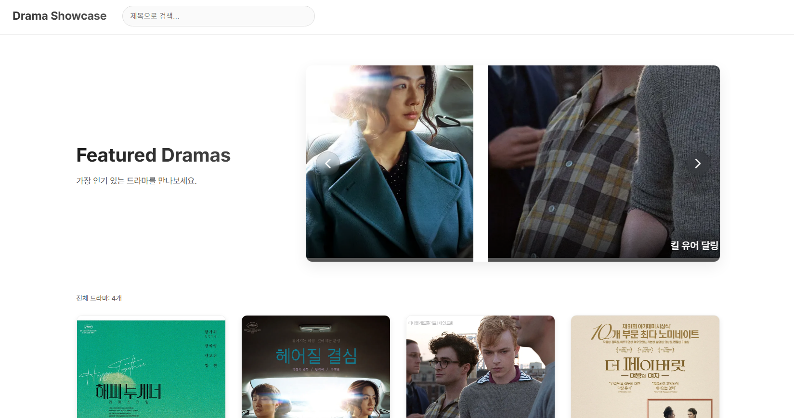
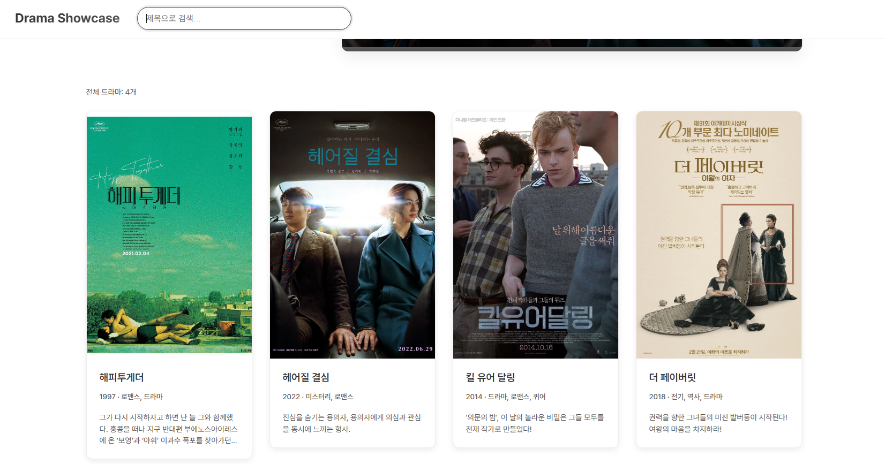
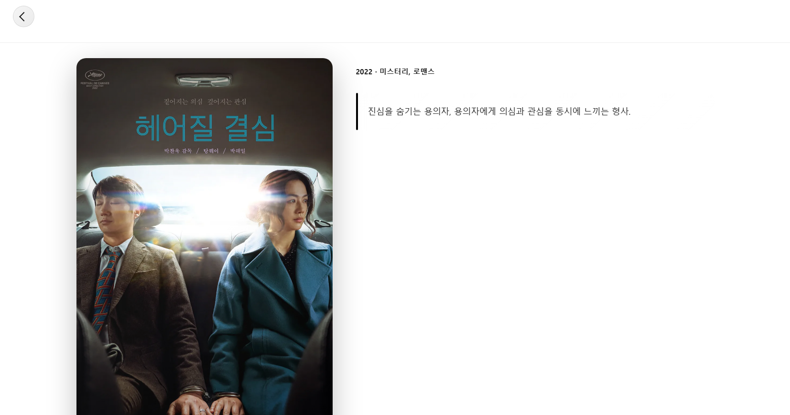

# 드라마 정보 사이트

## 소개

> 드라마 정보를 한눈에 확인할 수 있는 정적 웹 애플리케이션

---

## 사용된 기술 스택

    
    
    
    

> html, css, javascript, json

---

## 페이지 화면

## Main Page

 

><li>드라마 목록: dramas.json에서 불러온 데이터를 카드 형태로 그리드 레이아웃으로 표시합니다. 
><li>검색 기능: 제목, 장르, 설명 내 키워드를 디바운스 처리된 입력으로 필터링합니다. 
><li>로딩 스피너: 데이터 로딩 시 오버레이 형태의 스피너를 표시하여 UX를 개선합니다. 
><li>캐러셀: 인기(상위 8개) 드라마를 Swiper 라이브러리를 이용한 분수형 페이징 슬라이더로 보여줍니다. 
><li>네비게이션 버튼: 깔끔한 둥근 화살표로 슬라이드를 제어할 수 있습니다.

 

## Detail Page

><li>URL 파라미터: ?id= 값을 읽어 해당 드라마 객체를 dramas.json에서 찾습니다. 
><li>상세 정보 표시: 제목, 포스터, 제작 연도·장르, 설명을 레이아웃에 맞춰 렌더링합니다. 
><li>뒤로 가기: 커스텀 버튼(.back-btn-v4)으로 메인 페이지로 손쉽게 이동할 수 있습니다. 